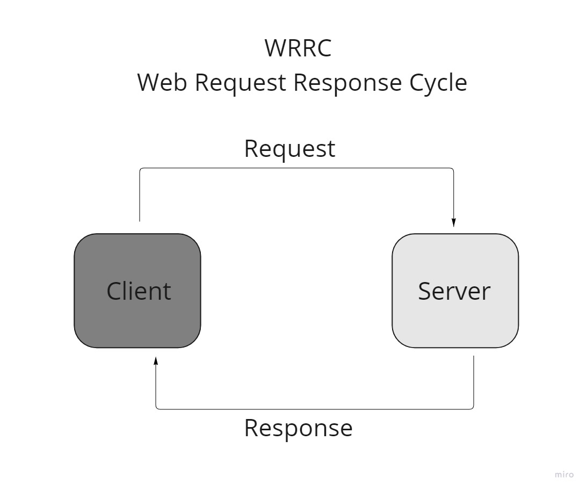

# Movies-Library

# Movies app - 1.0.0

**Author Name**: Bahaa Nimer

## WRRC

## The tree structure of my application.

.png>)

## Overview

## Getting Started

<!-- What are the steps that a user must take in order to build this app on their own machine and get it running? -->

1. Create a repository
2. Initialize your project by running the following command `npm init -y`
3. Create a new branch
4. Create basic file structure (server.js, .gitignore, .eslintrc.json )
5. Install the required packages for this task: `npm install express`
6. Create a route with a method of get and a path of /. The callback should use the provided JSON data.
7. Create a constructor function to ensure your data follow the same format.
8. Create a function to handle the server error (status 500)
9. Create a function to handle "page not found error" (status 404)
10. Add Documentation in your README file
11. Create a function to handle the 3rd party API calls

## Project Features

<!-- What are the features included in you app -->

So far just some get methods to handle the req and res.

What observations or questions do you have about what you’ve learned so far?

Nothing, so far.

How long did it take you to complete this assignment? And, before you started, how long did you think it would take you to complete this assignment?

It take about half hour.

Around the same time.

## Q&A for the task 12

What observations or questions do you have about what you’ve learned so far?

Nothing, so far.

How long did it take you to complete this assignment? And, before you started, how long did you think it would take you to complete this assignment?

It take about half hour.

Around 1 hour.
